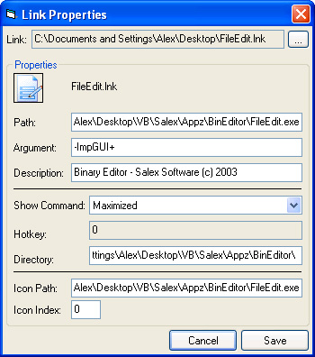



## Link File Properties \(Set, Retrieve\)

### Description

Retrieves and set's a Link File's(.lnk) attributes(Target, Directory, Description, Icon Path, Icon Index, .ect..). This project was requested by Lawrence.
 
### More Info
 

             |
---                |---
**Submitted On**   |2003-01-21 15:18:02
**By**             |[Alex Smoljanovic\(aLeX^rS\)](https://github.com/Planet-Source-Code/PSCIndex/blob/master/ByAuthor/alex-smoljanovic-alex-rs.md)
**Level**          |Beginner
**User Rating**    |3.8 (23 globes from 6 users)
**Compatibility**  |VB 5\.0, VB 6\.0
**Category**       |[Files/ File Controls/ Input/ Output](https://github.com/Planet-Source-Code/PSCIndex/blob/master/ByCategory/files-file-controls-input-output__1-3.md)
**World**          |[Visual Basic](https://github.com/Planet-Source-Code/PSCIndex/blob/master/ByWorld/visual-basic.md)
**Archive File**   |[Link\_File\_1532711212003\.zip](https://github.com/Planet-Source-Code/alex-smoljanovic-alex-rs-link-file-properties-set-retrieve__1-42621/archive/master.zip)

